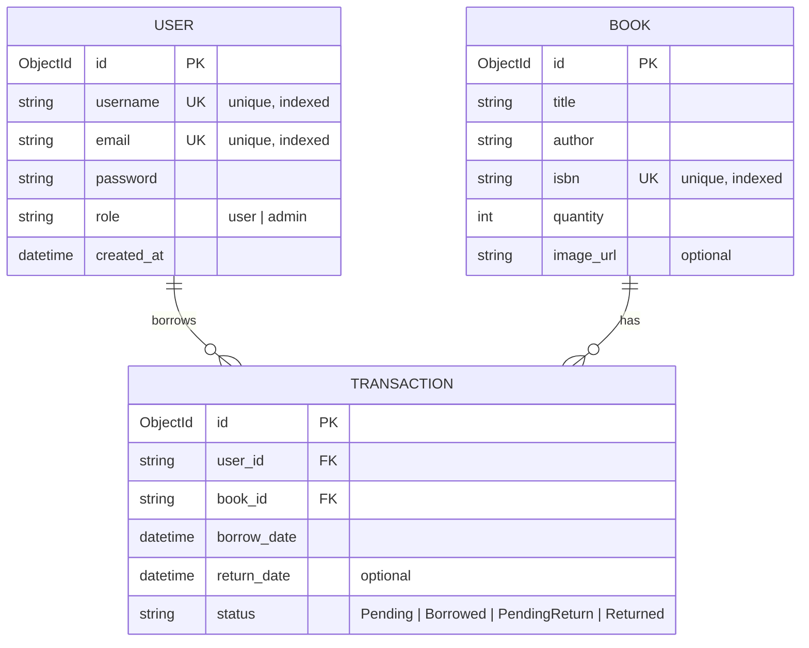

# ER-Diagram: ระบบยืม-คืนหนังสือ

## Mermaid ER-Diagram (Crow's Foot Notation)

## ความสัมพันธ์

- **USER → TRANSACTION (1:N)**: ผู้ใช้หนึ่งคนสามารถยืม-คืนหนังสือได้หลายครั้ง
- **BOOK → TRANSACTION (1:N)**: หนังสือหนึ่งเล่มสามารถถูกยืมได้หลายครั้ง

## Constraints

- `username` และ `email` ใน USER ต้องไม่ซ้ำกัน
- `isbn` ใน BOOK ต้องไม่ซ้ำกัน
- `user_id` ใน TRANSACTION ต้องอ้างอิงถึง USER ที่มีอยู่จริง
- `book_id` ใน TRANSACTION ต้องอ้างอิงถึง BOOK ที่มีอยู่จริง
